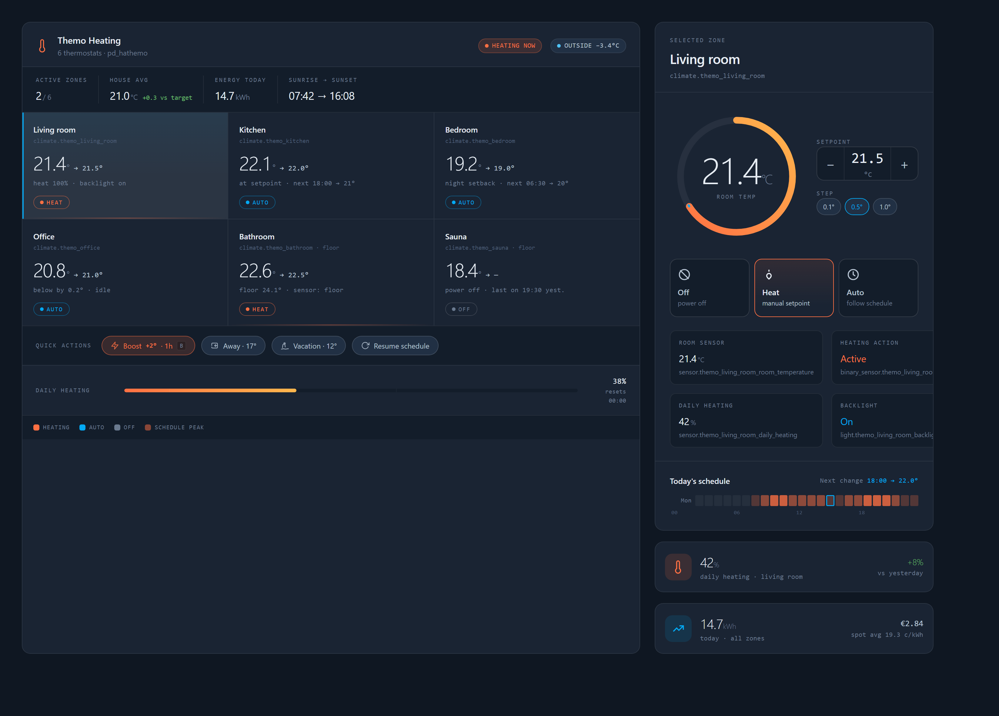

# PapaDog's Themo Control Card

[](https://github.com/hacs/integration)

A multi-thermostat [Home Assistant](https://www.home-assistant.io/) Lovelace card for
[Themo](https://themo.io) smart thermostats, built for the
[`pd_hathemo`](https://github.com/jnaatanen/pd-hathemo) integration. It puts **every
thermostat in one view**: a zone overview grid on the left, and a detail panel on the
right for the selected zone — current temperature ring, setpoint stepper, Off / Heat /
Auto mode, the device's heating schedule (heatmap + preset switch), room/floor sensors,
daily heating %, and the backlight toggle.



> **Requires the [`pd_hathemo`](https://github.com/jnaatanen/pd-hathemo) integration.**
> Install and configure that first. This card only *visualizes and controls* the
> entities that integration exposes (`climate.*`, the temperature sensors, the heating
> binary sensor, the backlight light, the daily-heating sensors, and the schedule
> websocket). All device discovery, cloud communication and the hard part belong to that
> project.

## Disclaimer

This is a **personal hobby project**, not affiliated with or endorsed by Themo. It is
provided **as is**, with **no warranty and no guarantee of fitness, correctness, or that
it works at all**. The author accepts **no liability** for any damage, data loss,
unexpected heating behaviour, energy cost, or any other consequence arising from its use.
Use it entirely at your own risk. See [LICENSE](LICENSE) for the full terms.

## Requirements

- Home Assistant 2025.1.0 or newer.
- The [`pd_hathemo`](https://github.com/jnaatanen/pd-hathemo) integration installed,
  configured, and exposing at least one `climate.*` thermostat.

## Installation

### HACS (recommended)

1. In Home Assistant, open **HACS**.
2. Open the three-dot menu → **Custom repositories**.
3. Add `https://github.com/jnaatanen/pd-themo-card` with category **Lovelace** (dashboard).
4. Install **PapaDog's Themo Control Card**. HACS adds the dashboard resource for you.

### Manual

1. Copy `themo-card.js` into `/config/www/`.
2. **Settings → Dashboards → ⋮ → Resources → Add** `/local/themo-card.js` as a
   **JavaScript Module**.
3. Add the card to a dashboard (see [`examples/lovelace.yaml`](examples/lovelace.yaml)).

## Dashboard layout — use a Panel view

This is a **wide two-column card** (overview + detail side by side, ~1440px). Home
Assistant's default *masonry* view caps every card at roughly one column (~480px), which
trips the card's responsive breakpoint and **stacks the two columns vertically**.

To get the side-by-side desktop layout, put the card in a full-width slot:

- **Edit dashboard → the view's settings (pencil) → View type: _Panel (1 card)_.**

The card is responsive by design: in a narrow slot (phone, narrow column) it stacks
cleanly; in a wide slot it goes two-column.

## Configuration

```yaml
type: custom:themo-card
title: Themo Heating
# entities:                # optional — auto-discovered from pd_hathemo if omitted
#   - climate.themo_living_room
#   - climate.themo_kitchen
# default_zone: climate.themo_living_room
# step: 0.5
# sun_entity: sun.sun
# energy:
#   today_entity: sensor.themo_energy_today
# quick_actions:
#   - { name: "Boost +2° 1h", icon: mdi:flash, service: script.themo_boost }
```

Nothing is required — with no options the card auto-discovers every `pd_hathemo`
thermostat and shows the first one in the detail panel.

| Option | Default | Notes |
| --- | --- | --- |
| `title` | `Themo Heating` | Card heading. |
| `entities` | *(auto)* | Explicit list of `climate.*` thermostats and their order. When omitted, the card auto-discovers every thermostat from the `pd_hathemo` platform. |
| `default_zone` | first zone | Which `climate.*` the detail panel opens on initially. |
| `step` | `0.5` | Setpoint +/- step. The thermostat's own `target_temp_step` is used when available. |
| `sun_entity` | *(off)* | A `sun.*` entity. When set, adds a **Sunrise → Sunset** stat to the strip. |
| `energy.today_entity` | *(off)* | A kWh sensor (your own template/utility-meter sensor) shown as a daily-energy glance card. |
| `energy.cost_entity`, `energy.spot_entity` | *(reserved)* | Accepted for forward-compatibility; cost/spot pricing is external data and not rendered yet. |
| `quick_actions` | `[]` | Chips that call a service. Each: `{ name, icon?, service, service_data? }` (e.g. point at your own `script.*`). |

## How it finds your thermostats

The `pd_hathemo` integration names entities after each thermostat's device. The card does
**not** assume a fixed id scheme — it:

1. Auto-discovers `climate.*` entities whose platform is `pd_hathemo` (or uses your
   `entities` list).
2. For each thermostat, resolves the sibling entities on the **same device** — room /
   floor / outside temperature, the heating binary sensor, the backlight light, and the
   daily-heating sensor.
3. Reads the device's heating **schedules** through the integration's
   `pd_hathemo/schedules` websocket command (the weekly setpoint grid) to draw the
   schedule heatmap and the "next change" readout, and switches the active schedule via
   the climate **preset** selector.

## Features

- **Multi-zone overview** — every thermostat as a tile (current → target temp, mode,
  live "heating" accent), with house-average and active-zone stats.
- **Detail panel** — temperature ring, setpoint stepper (Heat mode), Off / Heat / Auto
  mode tiles, room/floor sensor and daily-heating readouts, tappable backlight toggle.
- **Schedules** — today's setpoint heatmap, "next change → temp", and one-tap switching
  of the active schedule (Home / Away / …) via climate presets.
- **Optional sections** — Sunrise → Sunset, a daily-energy glance, and quick-action chips
  appear only when you configure their source.
- **Responsive** — two-column on a wide (Panel) view, single column when narrow.

## Roadmap / Backlog

- **Mobile dashboard layout** — a phone-optimized card surface.
- **Tablet dashboard layout** — a tablet-optimized card surface.
- Graphical (GUI) card config editor.
- Schedule setpoint editing (the integration is currently read-only for the weekly grid).

## Credits

- [`pd_hathemo`](https://github.com/jnaatanen/pd-hathemo) integration — the data source
  this card depends on.
- Design exploration by Open Design.

## License

[MIT](LICENSE) (c) Jouko Naatanen.
